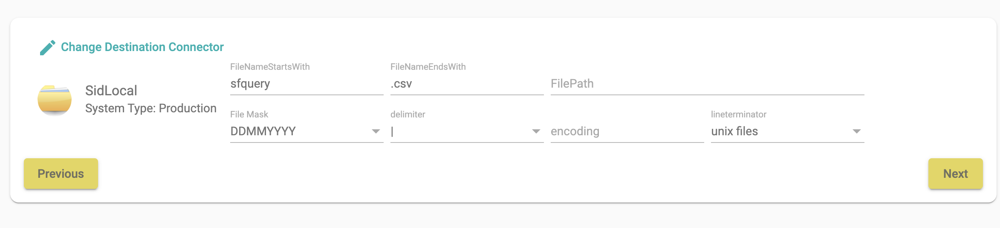
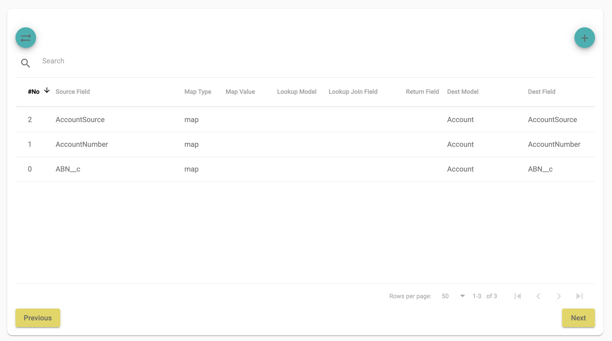

# Jobs

Jobs takes input from source connector (input) and sends to destination connector (output). for most jobs the input will be manipulate and mapped to destination via mapping before sending it to destination

## New job
#### Step 1
Let's select source, click on Change Source Connector as shown in below image

Once you select a connector SID requires Input data source from source connector. for e.g. if you choose Salesforce as source then Query is required as Input. if you choose AWS S3 or SidLocal then you are required to upload input file in SID for it understand fields in the file below is an example how you can input a local file

If you select Salesforce as Source, you can either write a custom query (valid query which can be run in Salesforce development console) or select a salesforce object and generate a query.

Once you have selected a valid source, Source Field Details should have all the fields from source.
If you are happy with source fields, press Next

#### Step 2
Next step is to select destination, click on Change Destination Connector

If you select S3 or SidLocal then you complete all the fields as shown below

Please note: File Mask is required for regular jobs, SID generates files names based on input for each run. let's look at an example, lets say you have a regular job which should generate filename sfquery_20012021.csv
then we input following values
* filenamestartswith: sfquery
* fileendwith: csv
* file mask: DDMMYYYY

If you select Salesforce as Destination like below

Following transaction type are allowed for salesforce bulk api

* insert
* update
* upsert

If you choose upsert then you are to enter upsert key

Press Accept and the destination config should look something like this

press Next

#### Step 3
Create mapping as below

On the left side you can see Auto Map fields, SID Auto map functionality will try to map the source fields to destination. Mapping is done based on field name. click the button to for sid to do auto mapping

you can add a field with the add button on the righ side of mapping section
the screen will look something like below
same screen is also shown for edit functionality, to edit an mapping simple select the field from the table. if number of fields in source is large then you can use the search bar to find the field. search bar allows to search on any text in the table.

