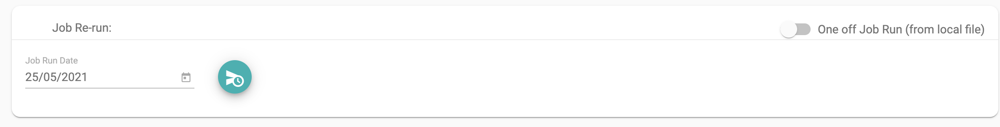
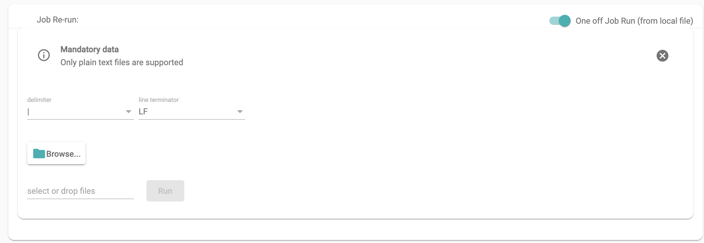

# Jobs

To Execute or Run a job, select the job and you should see a screen similar to below

## Run job
you can run a job 2 ways, regular run based on the run date or run a job based on new input data

#### Regular run

Select the run date and click the job run

check the Log's section once the job run is submitted

#### Oneoff run

To run the current job with local input data, toggle the Oneoff run button

## Edit job
Edit job let's you edit the current job configuration
you can follow the steps from
[Edit job](job.md)

## Clone job
Clone job generates a new job based on the configuration details of existing job
