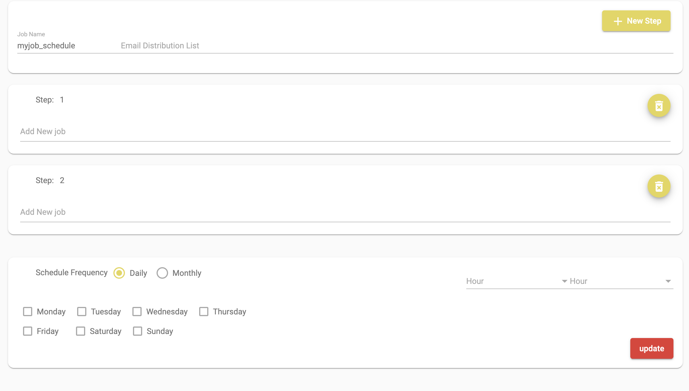

# Schedule
SID allows you to create job schedule, Each Step define the list of jobs to run in a step. Steps are ordered based on number and higher number step wont run until previous step is complete without error

Please note: ***background scheduler is still in development, you can run the schedule via cron***