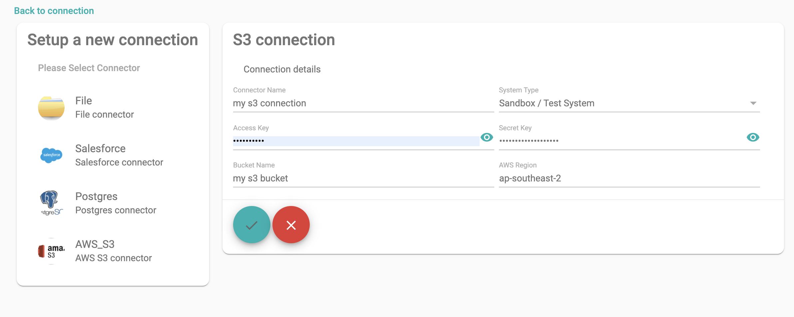

# Jobs
SID support following connectors
* Salesforce
* AWS S3
* Local
* Postgres (Work in progress)

## Salesforce
Salesforce Connector can be created as below

OAuth is currently not supported, connector requires
* User Name
* Password
* Token
* System Type

## AWS S3
S3 Connector can be created as below

all fields are mandatory

## Local
SIDLocal is Local filesystem of SID (area where SID sid installed)

## Postgres
Postgres connector is currently in development